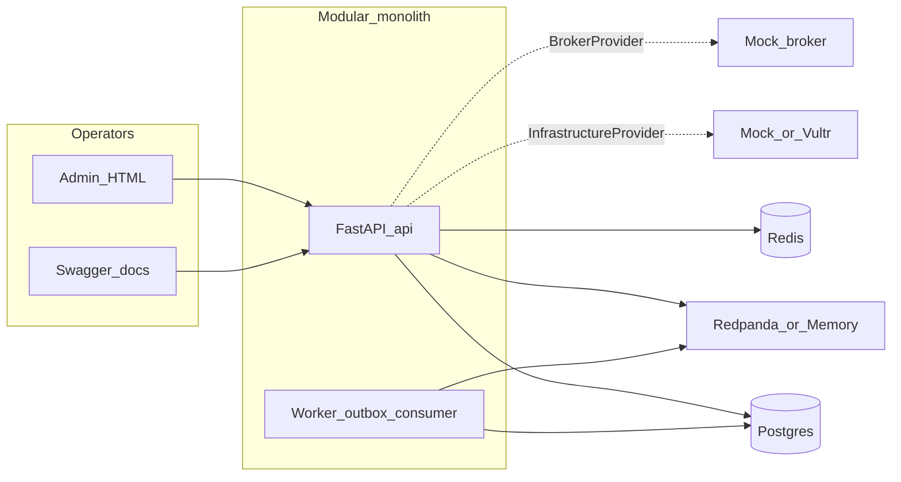
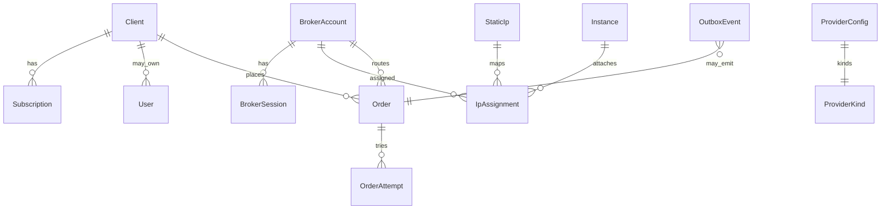
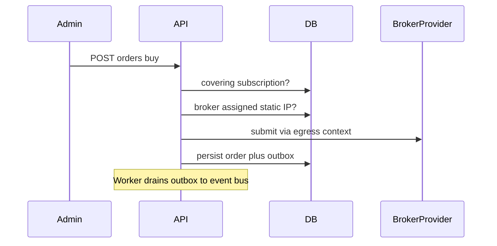
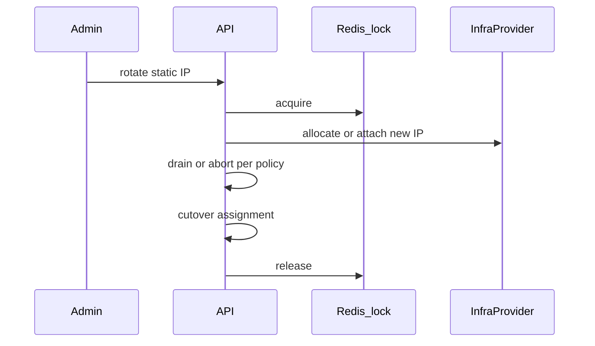

# Architecture

BrokerBridge is a **modular monolith**: one FastAPI process (API + Admin + OpenAPI) and one worker process, sharing Postgres, Redis, and an event bus. Integrations are behind **provider interfaces** so domain/services never import Vultr, Redis clients, Kafka clients, or broker SDKs directly.

## System overview

| Component | Responsibility |
|---|---|
| API | REST `/api/v1`, JWT auth, Admin static, Swagger |
| Worker | Outbox publish, event consume, background ops |
| Postgres | Brokers, IPs, instances, orders, subscriptions, config, outbox |
| Redis | Distributed locks, session cache, rate-limit windows |
| Event bus | Order/IP/config events for Admin Event Bus and ops |

## Provider architecture

Cold-start defaults come from env; **active rows in `provider_configs`** (Admin Runtime Config) win without restart.

| Kind | Local Lab typical | Render typical |
|---|---|---|
| Infrastructure | `mock` + `database` or `docker` | `mock` + **`database` only** |
| Broker | `mock` | `mock` |
| Event | `redpanda_local` (Compose) | cloud SASL or **memory** if bus unreachable |
| Lock / session / rate limit | `redis` | `redis` (e.g. Upstash) |

- **Mock infra `database`:** instances/IPs simulated in Postgres (CI, Render, default cold start).
- **Mock infra `docker`:** real containers labeled for Local Lab realism; requires Docker socket.
- **Vultr:** real adapter; activate with API key via Admin (write-only / masked secrets).

## Data model (core)

Primary tables (see `app/models/`): `users`, `clients`, `subscriptions`, `broker_accounts`, `broker_sessions`, `instances`, `static_ips`, `ip_assignments`, `orders`, `order_attempts`, `outbox_events`, `provider_configs`, `configuration_items`, health/whitelist/mock_infra helpers.

## Key sequences

### Order with assigned static IP (BR-G01)

### IP rotate

### Runtime Config activate

Validate (probe) → write `provider_configs` → ProviderManager refresh → subsequent calls use the new adapter (no redeploy).

### Subscription expiry (BR-G07)

Expire → client suspend / infra teardown per policy → trading blocked until a **covering ACTIVE** subscription exists again (create subscription restores trading).

## HA / scale (Part 24)

Designed path (not a fixed CI RPS claim):

- **API:** horizontally scale uvicorn workers / replicas behind a load balancer (JWT + shared Postgres/Redis).
- **Worker:** partition outbox / consumer groups; isolate noisy brokers with queues if needed.
- **Redis:** locks and rate windows; fail closed with `REDIS_UNAVAILABLE` when down.
- **Events:** Redpanda/Kafka partitions by topic keys; memory provider for demos when bus is unavailable.
- **DB:** append-friendly orders/outbox; avoid hot single-row contention on rotate via locks.

Local Lab can show honest light load (`hey` / Locust against Buy) and Redis-stop chaos. Path to higher throughput is more API replicas, partitioned workers, and a healthy Kafka-compatible cluster — not a single-box Compose claim.

See also [DEMO.md](DEMO.md) for how to exercise the system and [deploy/RENDER.md](deploy/RENDER.md) for cloud constraints.
